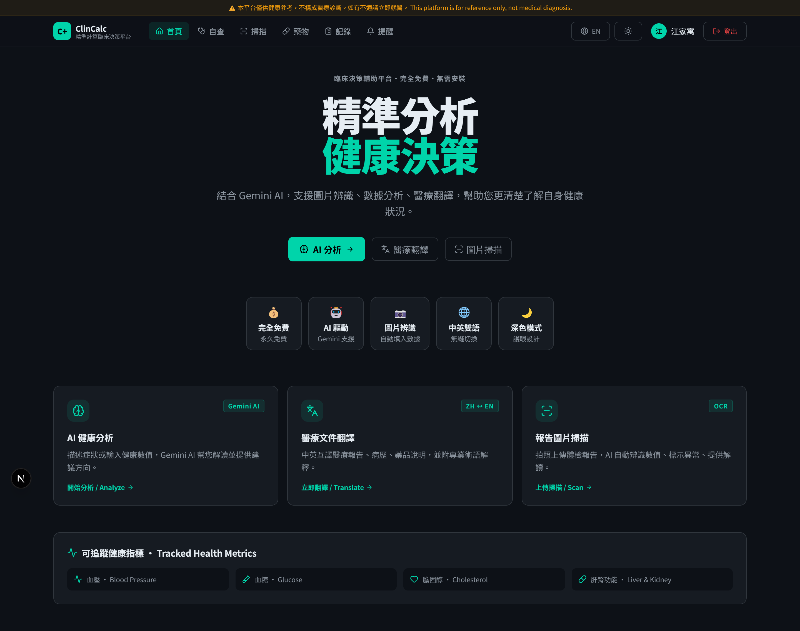
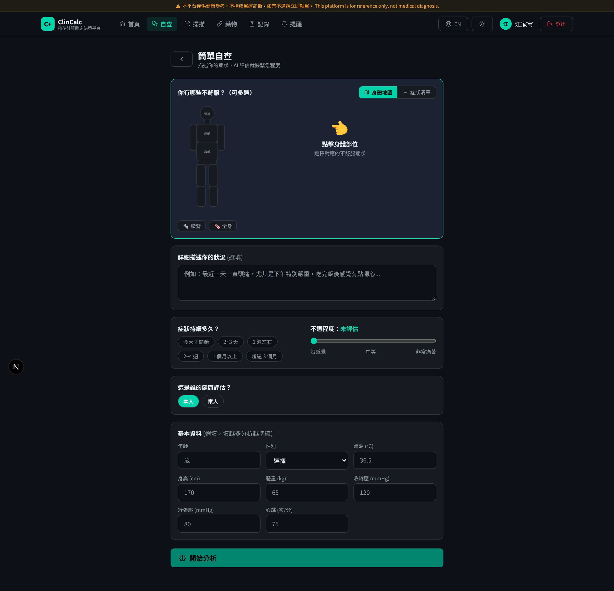
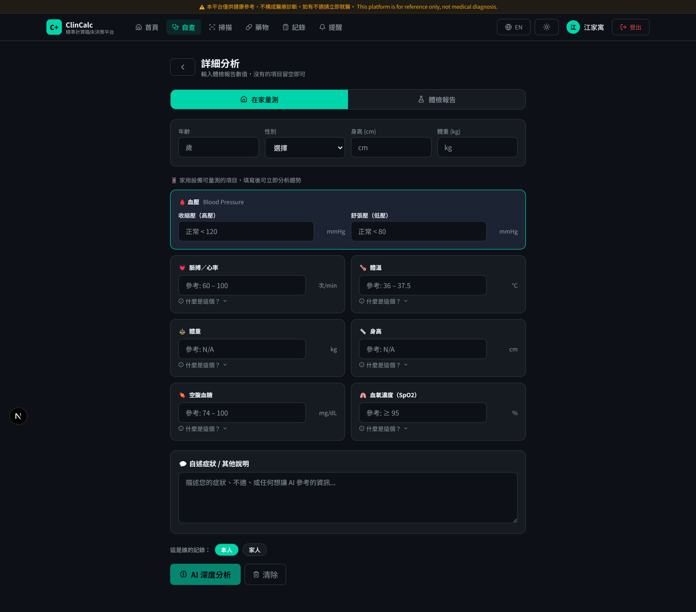
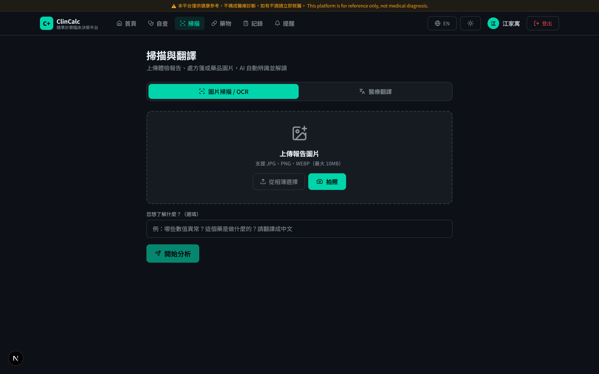
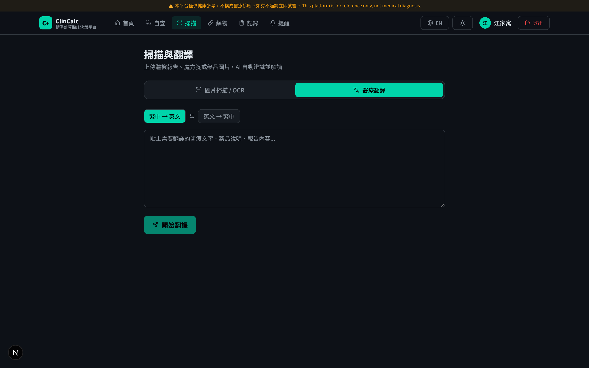
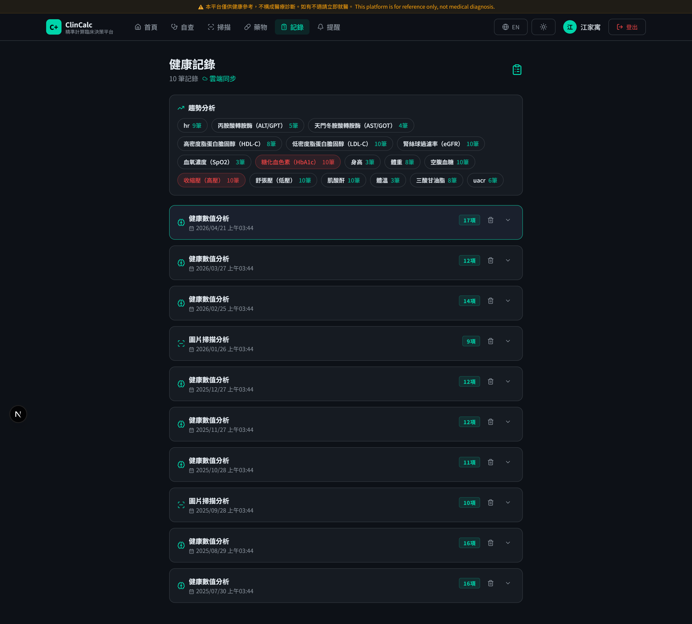
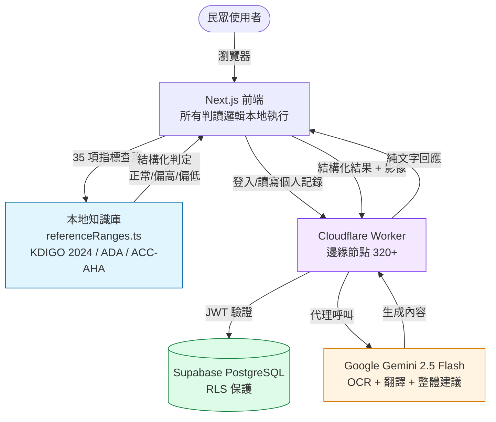

# ClinCalc — 民眾健康自查與 AI 解讀平台

> 銘傳大學生物醫學工程學系專題研究 · **Clin- 醫療生態系**之**民眾端**
> 同生態系作品：[ExClinCalc](https://github.com/yu8812/exclincalc)（醫事端）· [clinconvert](https://github.com/88jiayu/clinconvert)（FHIR 互通研究）




🌐 **線上體驗（無需註冊即可使用核心功能）：[clincalc.yuyulsc881209.workers.dev](https://clincalc.yuyulsc881209.workers.dev)**

ClinCalc 是針對台灣一般民眾設計的健康自查網站，提供 35 項常見體檢指標的本地即時解讀、KDIGO 2024 慢性腎臟病分期判讀、互動式身體地圖症狀問診、Google Gemini 2.5 Flash 影像 OCR 與中英醫療翻譯，以及個人健康記錄歷程追蹤。所有原始檢驗數值皆於瀏覽器內本地完成判讀，不上傳任何第三方 API。

## 為什麼做這個專案

很多民眾拿到體檢報告，看著一堆數字與專有名詞，**不知道哪些代表問題、哪些可以暫時不理會**。一般人會做的事是上網查、問家人、或乾脆忽略。這之中有兩個結構性問題：

1. **資訊不對等** — 醫療術語對普通人不友善，看不懂就無法做出判斷
2. **隱私顧慮** — 把檢驗數值貼到 ChatGPT 不安全；上傳到不熟的網站更不放心

ClinCalc 用兩個設計回應這個問題：

- **本地優先解讀**：35 項指標的判讀邏輯（含 KDIGO 2024 慢性腎臟病分期）**全部在瀏覽器內完成**，原始數值不離開使用者裝置
- **AI 為輔助而非主導**：Gemini 只接收結構化的「正常 / 偏高 / 偏低」判定後協助總結與建議，不直接評估原始數值，降低幻覺與誤判風險

目標：**讓沒有醫學背景的人也能看懂自己的體檢報告，並知道何時真的該就醫**。本系統不取代醫師，是進入醫療系統前的一個合理篩選層。

## 功能展示

| 互動式身體地圖 | 35 項指標即時判讀 |
|:---:|:---:|
|  |  |
| 17 個身體區域、44 種症狀，AI 提供初步病因排序 | 8 大分類指標，含 KDIGO G1–G5 慢性腎臟病分期 |

| AI 影像 OCR | 中英醫療翻譯 |
|:---:|:---:|
|  |  |
| 拍照上傳檢驗報告，自動辨識指標、數值與單位 | 醫療專有名詞雙向翻譯，標示專業詞彙 |


*個人健康記錄歷程：過去 9 個月時序圖（Recharts），可切換顯示任一指標組合*

## 核心功能

| 模組 | 路由 | 說明 |
|---|---|---|
| 互動式身體地圖 | `/check/simple` | 17 個身體區域、44 種症狀，搭配 Gemini 提供初步病因排序與紅旗症狀 |
| 本地即時分析引擎 | `/check/detail` | 35 項體檢指標即時判讀（8 大分類），KDIGO G1–G5（含 G3a/G3b 共六分期） |
| AI 醫療影像 OCR | `/scan` | 拍照上傳檢驗報告，Gemini 自動辨識指標、數值與單位 |
| 中英醫療翻譯 | `/translate` | 醫療專有名詞雙向翻譯，輔以底線粗體標示專業詞彙 |
| 用藥提醒 | `/meds` | 瀏覽器本地通知排程，支援跨裝置同步 |
| 健康記錄歷程 | `/records` | 過去 9 個月時序圖（Recharts），可切換顯示任一指標組合 |
| 病患授權 | `/consent/[token]` | 一次性權杖授權醫師查閱健康記錄（具時效，預設 7 天到期） |

## 技術棧

- **Next.js 16** App Router + React 19 + TypeScript
- **Tailwind CSS v4**（`@theme` 變數體系，支援明／暗主題）
- **Supabase**（PostgreSQL + Auth + Row Level Security）
- **Google Gemini 2.5 Flash**（醫療 OCR、症狀分析、雙語翻譯）
- **Cloudflare Workers**（OpenNext for Cloudflare 轉接器，全球 320+ 邊緣節點）
- **GitHub Actions**（自動部署、月度參考值同步、Supabase keep-alive）

## 系統架構



**設計重點**：
- 🔵 **本地優先** ── 原始檢驗數值不離本地，前端先過 [`referenceRanges.ts`](src/lib/referenceRanges.ts) 判定
- 🟠 **AI 為輔** ── Gemini 只接結構化判定結果（不看原始數值），降低幻覺風險與隱私風險
- 🟢 **資料庫層權限** ── Supabase RLS 在 PG 層保護個人健康記錄

## 知識庫優先的 Prompt 組裝策略

ClinCalc 在整合 Gemini 時採取「**先查知識庫、再交給 LLM**」的策略：

1. 使用者填完 35 項指標 → 前端逐一查 [`src/lib/referenceRanges.ts`](src/lib/referenceRanges.ts) 知識庫（中英文名、單位、男女參考區間、健康解讀、來源指引 KDIGO 2024 / ADA / ACC-AHA）
2. 對每個欄位呼叫 `checkAbnormal()` 判定為「正常 / 偏高 / 偏低 / 嚴重偏高 / 嚴重偏低」
3. 把**結構化判定結果**（不是原始數值）組成 prompt 交給 Gemini，僅讓它做整體性評估、生活建議與就醫時程
4. Gemini 不再需要記憶各項指標的正常範圍 → 降低幻覺、提升準確度與可追溯性

## 本地開發

### 前置需求
- Node.js 22+ (Windows 用戶請使用 webpack 模式：`npx next dev --webpack`)
- 一個 Supabase 專案（免費方案即可）
- 一個 Google AI Studio API Key（[aistudio.google.com](https://aistudio.google.com)）

### 步驟

```bash
# 1. 安裝依賴
npm install

# 2. 建立 .env.local（複製下方範本填入你的 keys）

# 3. 初始化資料庫：在 Supabase SQL Editor 依序執行
#    supabase/health_records.sql
#    supabase/medications.sql
#    supabase/seed_medications.sql       (選用)
#    supabase/add_role.sql                (角色與 is_pro)
#    supabase/seed_consumer_records.sql   (選用：示範用戶健康記錄趨勢)

# 4. 啟動 dev server
npm run dev                    # macOS / Linux
npx next dev --webpack         # Windows（避免 Turbopack WASM 問題）
# → http://localhost:3000
```

### `.env.local` 範本

```env
# Supabase（在 Dashboard → Settings → API 取得）
NEXT_PUBLIC_SUPABASE_URL=https://YOUR_PROJECT.supabase.co
NEXT_PUBLIC_SUPABASE_ANON_KEY=YOUR_ANON_KEY

# 僅伺服器端使用，繞過 RLS 用於 admin 操作
SUPABASE_SERVICE_ROLE_KEY=YOUR_SERVICE_ROLE_KEY

# Google Gemini 2.5 Flash（aistudio.google.com）
GEMINI_API_KEY=YOUR_GEMINI_KEY
```

> ⚠️ `.env.local` 已列入 `.gitignore`，**絕對不要 commit**。`SUPABASE_SERVICE_ROLE_KEY` 擁有繞過 RLS 的完整資料庫存取權限，僅可在伺服器端使用。

## 部署到 Cloudflare Workers

目前採**本機 wrangler 直推**（非 git-connected CI）：

```bash
npm run cf:build          # OpenNext 轉譯 → .open-next/worker.js（build 走 --webpack）
npx wrangler login        # 首次
npx wrangler deploy       # 部署到 Cloudflare Workers
```

> ⚠️ 這台 Windows 的 swc 原生 binding 失效，`dev` / `build` 已固定 `--webpack`（WASM 路徑）；opennextjs-cloudflare 也無法執行 Turbopack 輸出。

### Runtime 密鑰（`wrangler secret put`）
- `GEMINI_API_KEY`、`SUPABASE_SERVICE_ROLE_KEY`（僅伺服器端，繞過 RLS）
- `NEXT_PUBLIC_*` 於 build 時烤入前端（受 RLS 保護）

> `.github/workflows/` 為舊 CI 設定；遷移到 yu8812 帳號後目前以本機 wrangler 為主。

## 自動化 Workflows

| Workflow | 觸發 | 功能 |
|---|---|---|
| `deploy.yml` | push main | 自動建置並部署到 Cloudflare Workers |
| `keep-alive.yml` | 每 3 天 | Ping Supabase REST API 防止 free tier 休眠 |
| `sync-references.yml` | 每月 1 日 08:00 (台灣時間) | 將 `referenceRanges.ts` 同步到 `medical_references` 表 |

## 資料庫架構

ClinCalc 與醫事端 ExClinCalc 共用同一份 Supabase PostgreSQL，總計 **41 條 RLS policy**（由醫事端的 8 個安全 migration 建構，含 6 條 RESTRICTIVE AAL2 閘門）。ClinCalc 主要使用 `health_records`、`patient_consents`、`medications`、`medical_references` 四張表；個人健康記錄以 RLS 綁定 `auth.uid()`，僅本人與經一次性同意書授權的醫師可讀。

完整 schema 與 RLS 定義見 [`supabase/`](supabase/) 目錄與 [ExClinCalc](https://github.com/yu8812/exclincalc) 對應 SQL。

## 程式碼導覽（給審查者）

如果你是研究所教授、招生委員或對特定模組有興趣的工程師，以下是快速導覽：

| 想看什麼 | 看哪個檔 |
|---|---|
| 35 項指標判讀邏輯 + 知識庫結構 | [`src/lib/referenceRanges.ts`](src/lib/referenceRanges.ts) |
| KDIGO 2024 慢性腎臟病分期實作 | 同上（搜 `KDIGO`） |
| Gemini「先規則後 LLM」prompt 組裝 | [`src/app/api/`](src/app/api/) Gemini 相關路由 |
| 互動式身體地圖（17 區 / 44 症狀） | [`src/app/check/simple/`](src/app/check/simple/) |
| 病患授權一次性權杖實作 | [`src/app/consent/`](src/app/consent/) + 對應 Supabase migration |
| RLS Policy 定義 | [`supabase/`](supabase/) 目錄下 SQL 檔 |
| CI/CD 自動部署流程 | [`.github/workflows/`](.github/workflows/) |
| Cloudflare Workers 適配層 | [`open-next.config.ts`](open-next.config.ts) + [`wrangler.toml`](wrangler.toml) |

## 從實作中發現的研究問題

完成 ClinCalc 後，我整理出三個值得深入研究的方向，作為碩士階段研究計畫的延伸：

1. **「先規則後 LLM」策略可推廣到模糊地帶嗎？**
   目前策略在 KDIGO 分期、單一指標判定上運作良好，但在「綜合判斷」（如「整體報告看起來怎樣」）或「症狀-診斷連結」這類本質模糊的任務上，規則引擎覆蓋不足，LLM 又被限制不能自由判斷。**怎麼設計分級的「規則 ↔ LLM」介入比例**，是值得量化研究的問題。

2. **臨床指引版本變動如何反映到 CDSS？**
   KDIGO 2024 跟 KDIGO 2012 在分期邊界上有實質差異，且每幾年更新一次。**手動更新規則庫無法持續**。是否可以用 RAG 把臨床指引當動態知識庫，讓 CDSS 自動同步指引變動？這需要嚴謹的版本管理研究。

3. **多模態 AI 在非專業使用者場域的應用限制**
   ClinCalc 用 Gemini 做影像 OCR 與中英翻譯，效果可用但偶有錯誤。**對沒有醫學背景的使用者，多少程度的 AI 錯誤是可容忍的？怎麼設計 disclosure 與 fallback？** 這是 trust-aware design 的研究方向。

延伸閱讀：[「先規則後 LLM」案例研究](https://github.com/yu8812/ClinCalc/blob/main/docs/case-study-rule-first-llm.md)

## 學術引用

本專題撰寫於 2026 年 2 月，相關論文：

> 江家寓，《醫療輔助系統的設計與實作——以慢性腎臟病評估為核心案例之雙層健康資訊平台》，銘傳大學生物醫學工程學系專題研究，2026。

## 我是誰

**江家寓 / Chia-Yu Chiang**
銘傳大學 生物醫學工程學系 · 2026 應屆畢業
跨領域：電腦通訊工程 → 生物醫學工程
研究興趣：醫療資訊系統 / 臨床決策支援 / LLM 安全嵌入

🌐 **個人網站**：[jiayuselfweb.pages.dev](https://jiayuselfweb.pages.dev)（含完整 case study、研究探討、Reading List）
📧 yuyulsc881209@icloud.com
💻 GitHub：[github.com/yu8812](https://github.com/yu8812)

## Clin- 生態系

本作品是 **Clin- 系列**之一 ── 4 件作品共用同一套技術主軸
（Cloudflare Workers + Supabase + PostgreSQL RLS + TypeScript strict）。
不是各做各的、是**一個生態系**、環環相扣：

| 作品 | 角色 | 對應 |
|---|---|---|
| **ClinCalc**（本作品） | 民眾端 · 健康自查 + AI 解讀 | 入口：把醫療資料變得**看得懂** |
| [ExClinCalc](https://github.com/yu8812/exclincalc) | 醫事端 · 診所 CDSS | 流程：醫師 / 護理師 / 藥師完整工作流 |
| [clinconvert](https://github.com/88jiayu/clinconvert) | 互通研究 · FHIR R4 轉換 POC | 標準化：跨機構資料**可互通** |
| [Kaizei](https://jiayuselfweb.pages.dev/projects/kaizei) | 跨領域 · Personal Finance OS | 證明同套工程方法**跨領域複用** |

設計理念：**隱私先行（local 端處理）· 規則優於 LLM · 安全在資料庫層**。
詳見[個人網站](https://jiayuselfweb.pages.dev)。

歡迎研究合作、面談請益、或對任何技術細節提問。

## 授權

MIT License — 學術與非商業用途自由使用。商業使用請先聯絡作者。

本系統提供之健康解讀僅供參考，**不構成任何醫療診斷或處方**，使用者應諮詢合格醫師取得正式醫療建議。
